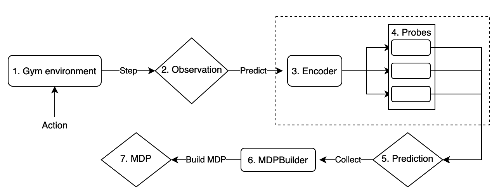
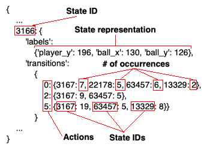
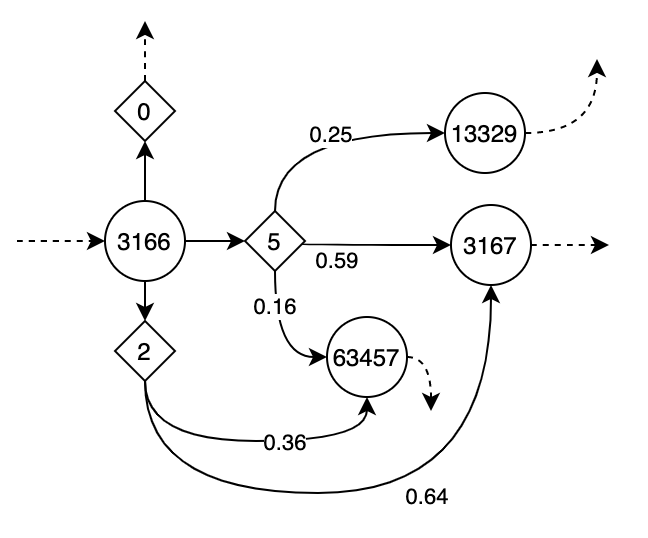

# Learning State Representations for Formal Verification

This project is based on, and builds upon the code of AtariARI, found here: https://github.com/mila-iqia/atari-representation-learning.

This project contains an extension of above repository for learning state representations of Atari 2600 games and generating models amenable for model checking. The code in this project uses the functionality for training an encoder and probes, and for obtaining state label predictions. Furthermore, predictions obtained can be collected to build a model of the environment in the form of a Markov Decision Process.

## Install
First follow installation instructions at https://github.com/mila-iqia/atari-representation-learning. Do a full installation (not only AtariARI wrapper) if you want to train encoder and probes. Next, the code in this repository can be downloaded and executed. The file `run_atari.py` shows how to use the code in this project and contains a lot of comments. Below more information is given on each part of the code.

## Pipeline



To learn a model of an Atari environment, a pipeline has been created. An overview of this is shown in image above. In this pipeline, an action is applied on the Gym environment (1) to obtain an observation (2) consisting of a matrix of grayscale values representing the game screen at that moment. The observation is given to the encoder (3) and linear probes (4) to obtain a prediction (5) of the state corresponding to the observation. The prediction and applied action are given to an MDP Builder (6), which collects this information for all observations produced by the environment. The MDP builder uses the predictions to identify states and transitions, and keeps a count of the number of occurrences of every transition. Finally an MDP (7) can be created, represented as a PRISM file.

### Using the encoder and probes
This repository contains a class `AtariARIHandler}`. This class handles encoder training and obtaining predictions using the AtariARI code. In the code fragment below, the usage of this handler is shown. It takes an `args` object containing configuration settings for the encoder and probes, and also the Gym environment name. In this example an environment is created for the game Pong. A list of available games can be seen in the paper found in the AtariARI repository. The handler creates an OpenAI Gym environment (using the described wrapper) that can be obtained with the `get_gym_env()` function. The `probe_setup()` function initializes the encoder and probes. If models exist in the specified location, they are loaded. Otherwise new models are trained using PyTorch (with support for GPU/CUDA).
```python
args.env_name = 'PongNoFrameskip-v4'
handler = AtariARIHandler(args, wandb) # args and wandb are objects with config
gym_env = handler.get_gym_env()
handler.probe_setup()
```

### Stepping through the Gym environment
After setting up the encoder and probes as shown above, the Gym environment can be used in the normal way. An example is shown in the code fragment below, in which 100 steps are performed with some `action` using the environment obtained from the `AtariARIHandler` instance. Each step returns the following information:

* obs: observation of the environment after one step. This is a 210 x 160 matrix of gray scale values representing the current game screen.
* reward: reward achieved by the previous action.
* done: boolean indicating the end of an episode. For Atari games this means that the game ended and the environment needs to be reset.
* info: dictionary containing the ground truth labels corresponding to the observation. As explained, the number of labels in this dictionary depends on the game. The values are discrete numbers between 0 and 255.

```python
obs = gym_env.reset()  # Reset env before use
for i in range(100):
    gym_env.render()  # Render the game to the screen
    obs, reward, done, info = gym_env.step(action)
```

### Obtaining state predictions
The observation matrix received when performing a step on the environment can be used to obtain a state label prediction. For this, the handler contains a function `predict(obs)` that puts a single observation through the encoder and uses each probe to predict the value of each label. The result is a dictionary with the same labels as the `info` object, but then with predicted values instead of ground truth. Alternatively, batches of observations can be put through the encoder instead of one at a time. This requires creating batches of observations of reasonable size. In the benchmark found in the AtariARI repository, batches of 64 observations are used. For this, the handler contains a function `predict_batch(observations)` where `observations` is a NumPy array with dimensions (*n* x 210 x 160 x 1), filled with *n* observations. The result is a list with $n$ dictionaries containing labels corresponding to the given observations.

### MDP Builder
The code of this project contains a class `MDPBuilder` that can be used to collect observations and to build a Markov Decision Process. The information needed to create an MDP is stored in a structure of dictionaries where every distinct observation (in the form of a dictionary with label - value pairs) is treated as a state and assigned a unique numeric ID. The `MDPBuilder` keeps a count of how many times the same transitions occur between states (with some action). See the image below for an example of the data structure. The state of the `MDPBuilder` itself can be directly saved to a file (using pickle),
so building of an MDP can be continued later. An MDP can be generated using either PRISM or JANI (JSON) format. The probability of a transition is calculated as the fraction of the total number of transitions for the corresponding action. The accuracy of these probabilities of course depends on the number of observations used to create the MDP. Below an example is shown that is the result of the structure also shown below.


<br>Structure of dictionaries representing the states and transitions. Each entry has a state ID as key, and a dictionary as value with labels (the state representation) and transitions, which include the actions and number of occurrences.


<br>Part of an MDP corresponding to image above}. The circles are states, the diamonds are actions. The dotted arrows represent transitions not shown here.

#### Creating an `MDPBuilder` object
The `MDPBuilder` constructor requires two arguments. The first is a list of label names to use for the MDP states. For some games many labels are available, but only a few might be desired for modeling the states of the MDP. The second argument is a list of actions to use. The Arcade Learning Environment (ALE) has a predefined discrete action space. For example, 1 is action 'fire', and 2 is 'up'. For every game that the encoder can create predictions for, the number of available actions is also defined. If a game has an action space of 6, then the actions 0 to 5 of ALE are available. However, some actions have no result, or the same result as another action. For example, Pong has action 'fire', but this has no result. For flexibility, the actions to use for the MDP can be defined by passing a list to the `MDPBuilder`. Note that the same actions have to be used for collecting frames from the Gym environment. See the code below for a usage example.
```python
labels_to_use = ['ball_x', 'ball_y', 'player_y']  # Only collect these 3 labels
actions_to_use = [0, 2, 5]  # Only use these actions ('noop', 'up' and 'down')
mdp_builder = MDPBuilder(labels_to_use, actions_to_use)
```

#### Collecting predicted state information}
After a predicted state representation is obtained, it can be passed to the `MDPBuilder` using the function `add_state_info(prediction, action)` (see code below). When this function is invoked:
* If the predicted state (consisting of a dictionary with labels and values) was not seen before, it is added as a new state and assigned a numeric ID. Otherwise, the ID is looked up.
* Using the ID, a transition is added between the previous seen state and this one, for the given action. If the transition was seen before, its count is incremented.

```python
for i in range(n_steps):
    action = mdp_builder.get_random_action()  # Get random action
    obs, reward, done, info = gym_env.step(action)  # Use action for getting obs
    prediction = handler.predict(obs)  # Obtain prediction
    mdp_builder.add_state_info(prediction, action)  # Add to MDPBuilder
    
# Save the MDPBuilder state to a file:
mdp_builder.save_builder_to_file('mdp_builder/mdp_builder.pkl')

# Export MDP to PRISM format
mdp_builder.build_model_file('path/mdp.pm', format='prism')
```

#### Export MDP
Calling the function `build_model_file(path, format)` will export the MDP structure to a file that can be read with a model checker like Storm (http://stormchecker.org). Currently two language formats are implemented, PRISM and JANI. However, because JANI is JSON, it is very verbose and creates files four times larger than PRISM files. At this moment, the MDP is represented using local nondeterminism, meaning that the MDP consists of a single module with one command for every state and for every action. See code below for an example of a how transitions are represented in PRISM language format.

```
// Command describing transitions for some action
[] player_y=186 & ball_x=205 & ball_y=0 -> 
  0.75 : (player_y'=186) & (ball_x'=205) & (ball_y'=0) + 
  0.25 : (player_y'=195) & (ball_x'=205) & (ball_y'=0);

// Transitions from same state as above, different action
[] player_y=186 & ball_x=205 & ball_y=0 -> 
  0.33 : (player_y'=186) & (ball_x'=205) & (ball_y'=0) + 
  0.33 : (player_y'=187) & (ball_x'=205) & (ball_y'=0) + 
  0.17 : (player_y'=181) & (ball_x'=205) & (ball_y'=0) + 
  0.17 : (player_y'=190) & (ball_x'=205) & (ball_y'=0);

// Different state
[] player_y=187 & ball_x=205 & ball_y=0 -> 
  0.33 : (player_y'=192) & (ball_x'=205) & (ball_y'=0) + 
  0.33 : (player_y'=187) & (ball_x'=205) & (ball_y'=0) + 
  0.33 : (player_y'=184) & (ball_x'=205) & (ball_y'=0);
```